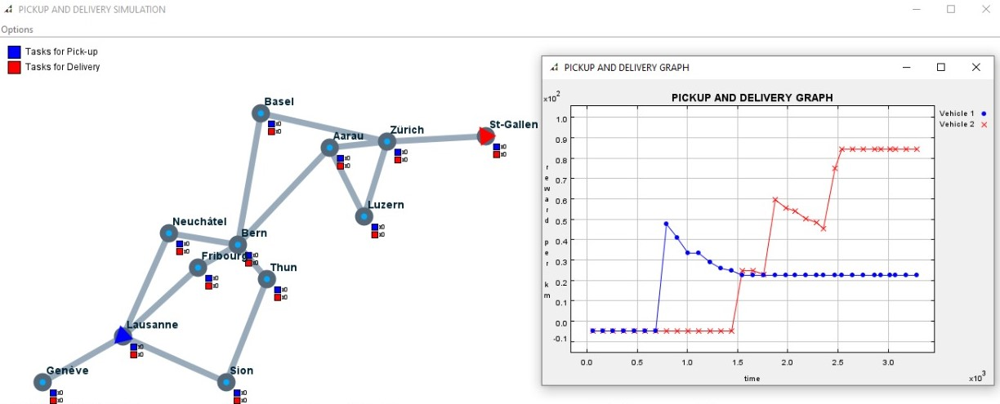

# Agente Deliberativo
El programa consiste en la implementación de un agente deliberativo
que opera dentro del "mundo" de logist, a fin de recoger y entregar paquetes 
de la manera mas óptima posible.

Un agente deliberativo construye un plan de acciones a realizar para alcanzar un objetivo.
además, tiene metas claras y conoce el entorno en el que actúa. Este agente recibe
inicialmente una lista paquetes que deben ser recogidos y entregados a ciudades destino.

Para la implementación del agente se ha utilizadó el algoritmo de busqueda BFS y A*,
modelando el problema de la siguiente manera.

### State
Se ha definido una clase State que representa los posibles estados que se puede encontrar el agente.
Este estado tiene como parámetro la ciudad actual donde se encuentra el vehículo, la lista de paquetes a ser recogidos,
una lista de paquetes a ser entregados, una lista de acciones a realizar y la capacidad del vehículo de carga.
### Actions 
Para realizar las tareas, el agente debe analizar la existencia de paquetes en la ciudad que visita para poder
definir la acción a realizar. 

*   En caso que existiera un paquete a ser recogido en la ciudad que se encuentra,
el agente debe realizar laacción "PICKUP". 

*   Si un paquete tiene como destino la ciudad donde se encuentra el 
vehículo, realiza acción "DELIVERY".

*   Caso contrario, simula moverse hasta la ciudades donde debe recoger o entregar un paquete,
para ello realiza la acción "MOVE".

### BFS 
Este es un algoritmo de búsqueda no informada, utilizado para recorrer o buscar elementos en un árbol.
Intuitivamente empieza en la raíz y se explora todos los nodos sucesores. Para cada uno de ellos se explora 
los sucesores respectivos hasta recorrer todo el árbol. Este algoritmo no usa ninguna estrategia
heurística.

Para hallar la solución esperada, se realiza esta busqueda hasta llegar a un estado terminal,
que se da cuando las listas de PICKUP y DELIVERY del vehículo, estan ambas vacías. 
### A STAR (A*)
Este es un algoritmo de busqueda informada, que se emplea frecuentemente debido a su integridad,
optimización y eficiencia. A partir de un nodo inicial específico, su objetivo es encontrar una 
ruta al nodo objetivo con un costo mínimo. 

Para encontrar la ruta óptima se basa el el costo y la estimación del mismo para extender
la ruta hasta la meta. Este algoritmo selecciona que minimiza f(m) = g(m) + h(m), donde g(m) 
es el costo de la ruta desde el nodo de inicio hasta m y h(m) es una heurística que estima el 
costo de la ruta mas barata de m el estado final.  

La heurística que se implementó se basa en estimar el costo hasta el mayor costo desde m hasta el
estado final, considerando que al momento de entregar un paquete, el agente recibe un reward por 
la entrega.

##Resultados Obtenidos

En las siguientes imagenes se muestra la ejecución del programa con 5 paquetes, un agente random
(vehículo 1, azul) y los démas son agentes deliberativos que emplean los algoritmos de búsqueda correspondiente. 
####-   Con un agente deliberativo.
*   BFS 

*   A*

####-   Con dos agentes deliberativos.
*   BFS 

*   A*

####-   Con tres agentes deliberativos.
*   BFS 

*   A*

